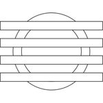

# Tomography Partitioning Tools (TPT)



TPT is a software library and tools for data partitioning of large tomographic
reconstruction problems.

It uses a modular system, where kernels, geometries, algorithmic skeletons are
independent and can be mixed and matched. We support a general model for
distributed computing, enabling the resulting algorithms to run on clusters
There is support for 2D, 3D or higher dimensional reconstructions, and support
for arbitrary floating point types.

# Tools

- `tpt_grcb` partitioning tool based on an updated _geometric recursive coordinate bisectioning_ algorithm.
- `tpt_stats` stats tool to evaluate partitionings.
- `tpt_partition` (deprecated), a partitioning tool based on the original _geometric recursive coordinate bisectioning_ algorithm.

It is also possible to perform partitioning on geometries from the ASTRA
toolbox. This can be done using the Python bindings, see
`python/examples/astra_partition.py`.

# Library

## Code examples for reconstruction tasks

In addition to the partitioning tools, you can run reconstructions using TPT.
For example, to reconstruct a Shepp-Logan phantom using SIRT:

```cpp
#include "tpt/tpt.hpp"

using namespace tpt;

int main() {
    using T = float;
    constexpr dimension D = 2_D;

    int size = 128;
    auto v = volume<D, T>(size);
    auto g = geometry::parallel<D, T>(v, size, size);
    auto f = modified_shepp_logan_phantom<T>(v);
    auto k = dim::joseph<D, T>(v);
    auto p = forward_projection<D, T>(f, g, k);

    auto x = reconstruction::sirt(v, g, k, p);
    ascii_plot(x);
}
```

Geometries and kernels can be used interchangeably. The reason is that we take
the following approach to these concepts:

- A geometry acts as nothing more than a container of lines, so you can write:
```
for (auto line : geometry) {
    // use line
}
```
- A discrete integration method takes a line, and produces a number of 'matrix elements', that contain the voxel (as an index), and the attenuation coefficient (value of the matrix element):
```
for (auto element : projector(line)) {
    // element.index is the voxel
    // element.value is the coefficient
}
```

Algorithms can be written in an efficient but flexible manner. There are also
some standard algorithms implemented, including `ART`, `SART`, `CGLS`, and
`SIRT`.

### Python

The Python bindings expose the different concepts (images, volumes, geometries
and dims) as well as the standard implemented algorithms.

# Building

## Dependencies

The following libraries are required:

External:
- [glm](http://glm.g-truc.net/0.9.8/index.html) header only mathematics library
- (optional) [RECAST3D](https://github.com/cicwi/RECAST3D) as a visualization server

Provided as submodules
- [Catch](https://github.com/philsquared/Catch), for unit tests
- [fmt](https://github.com/fmtlib/fmt) as an iostream replacement
- [bulk](https://github.com/jwbuurlage/Bulk) for distributed computing
- [cpptoml](https://github.com/skystrife/cpptoml) for reading specification and configuration files
- (optional) [zeromq](zeromq.org) for communicating with visualization servers
- (optional) [pybind11](https://github.com/pybind/pybind11) to generate Python bindings
- (optional) MPI for distributed reconstruction

The following build tools should be available on the system:
- [CMake](https://cmake.org/) (>= 3.0)
- Modern C++ compiler (with support for at least C++17), e.g. GCC >= 7.0 or clang >= 4.0

The library is being tested on Fedora 28, but should be portable to other Linux
distributions.

## Building process

The core of the library is header only, so it does not have to be built itself.
We start with initializing the submodules:

```
git submodule init
git submodule update --remote
```

To build the examples:

```
cd build
cmake ..
make
```

The resulting binaries will be in the `bin` folder.

## Building the Python bindings

To generate and use the Python bindings:

```
cd build
cmake .. -DPYTHON_BINDINGS=on 
make
cd ../python
pip install -e .

python examples/minimal_example.py
```

## Building with optional features

To build the ZMQ and MPI based examples, run the following instead of `cmake ..`.

```
cmake -DDISTRIBUTED=on ..
```
